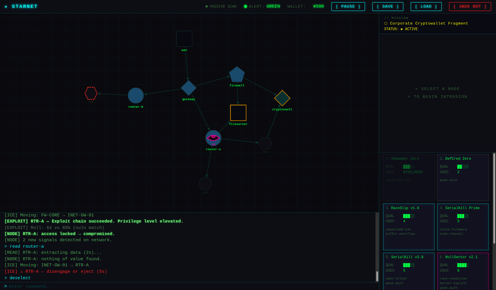

# STARNET



A cyberpunk nethacking game with an interplanetary setting.

You are a decker. You jack into a corporate LAN, probe its nodes for vulnerabilities,
exploit your way through security systems, and loot macguffins before the trace countdown
reaches zero. One ICE entity patrols the network. The alert system is layered — subvert
the IDS before it reports you to the security monitor.

**→ [Read the Player's Manual](MANUAL.md)**

---

## Running the Game

```bash
make serve    # starts a local dev server at http://localhost:3000
```

Then open `http://localhost:3000` in a browser. No build step required.

## Tech Stack

- Vanilla HTML/CSS/JS — no framework, no bundler
- [Cytoscape.js](https://cytoscape.org/) (CDN) for network graph rendering
- ES modules, JSDoc `@ts-check` for lightweight type safety

## Development

```bash
make check    # run tsc type checker (no emit)
```

See [`CLAUDE.md`](CLAUDE.md) for architecture notes, dev workflow, and design principles.
See [`docs/SPEC.md`](docs/SPEC.md) for the full game design document.
