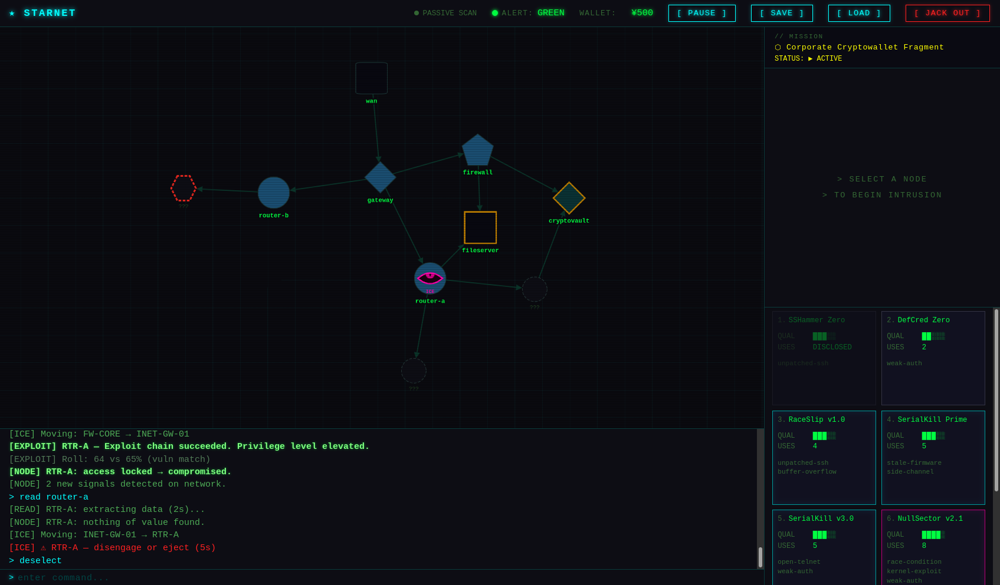

# STARNET



A cyberpunk nethacking game with an interplanetary setting.

You are a decker. You jack into a corporate LAN, probe its nodes for vulnerabilities,
exploit your way through security systems, and loot macguffins before the trace countdown
reaches zero. ICE patrols the network, hunting your disturbances. The alert system is
layered — subvert the IDS before it reports you to the security monitor.

Networks are either hand-crafted or procedurally generated, and seeded with hand-authored
set-piece puzzles.

**→ [Read the Player's Manual](MANUAL.md)**

---

## Running the Game

```bash
make serve    # starts a local dev server at http://localhost:3000
```

Then open `http://localhost:3000` in a browser. No build step required.

## Tech Stack

- Vanilla HTML/CSS/JS — no framework; game code is unbundled ES modules
- [Cytoscape.js](https://cytoscape.org/) for network graph rendering and [Lit](https://lit.dev/)
  for UI components, both bundled locally via esbuild into `dist/` (run `make bundle-vendor`)
- ES modules, JSDoc `@ts-check` for lightweight type safety

## Development

```bash
make check    # run tsc type checker (no emit)
```

See [`CLAUDE.md`](CLAUDE.md) for architecture notes, dev workflow, and design principles.
See [`docs/SPEC.md`](docs/SPEC.md) for the full game design document.

## License

The Starnet **engine** is licensed under the **GNU Affero General Public License v3.0**
([`LICENSE`](LICENSE)). It bundles [Strudel](https://strudel.cc/) + superdough for audio, which are
AGPL-3.0; bundling them makes the combined work AGPL-3.0.

Following the **Doom model**, game *content* — future content packs ("wads": songs, missions,
assets under `audio-content/`) — is kept as separately-licensed data loaded at runtime, never woven
into the engine source, so it can carry its own license. As an AGPL §13 courtesy, the running app
shows a **source** link to this public repository.
