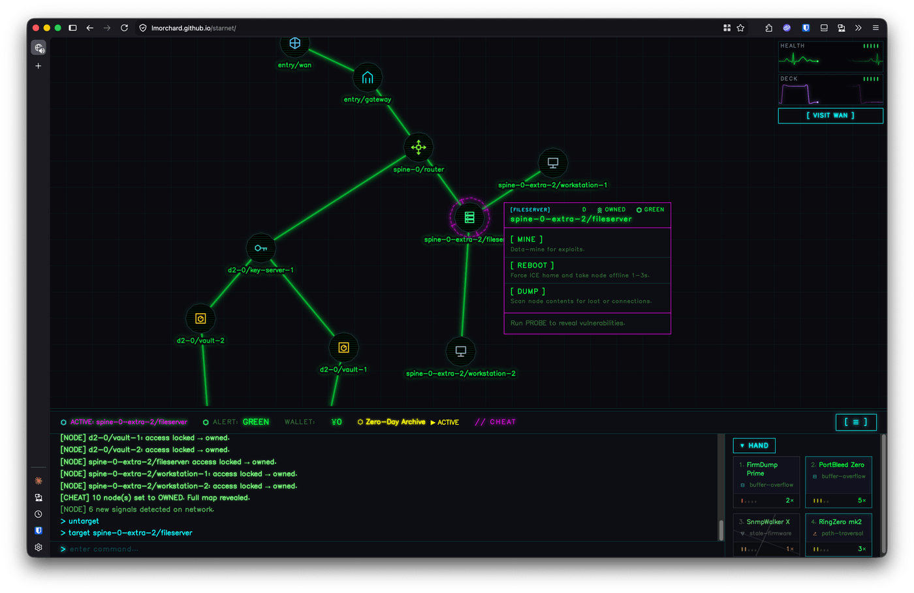

# Butterchurn brain-damage overlay — Implementation Plan

> **For agentic workers:** REQUIRED SUB-SKILL: Use superpowers:subagent-driven-development (recommended) or superpowers:executing-plans to implement this plan task-by-task. Steps use checkbox (`- [ ]`) syntax for tracking.

**Goal:** Build two checked-in reference labs that let Les *see* whether butterchurn's psychedelia, composited over the vector graph, reads as intentional brain-damage — driven by a hybrid of game audio + synthetic shock impulses + game-state compositing.

**Architecture:** Lab A is a self-contained HTML file (butterchurn via `esm.sh`, composited over a static graph screenshot, placeholder mp3 audio, slider controls). Lab B is a runtime module injected into the *live* game via a `?dev` flag, tapping the real Strudel/superdough `AudioContext` and event bus, composited over the live `#cy`. Neither modifies shippable game logic.

**Tech Stack:** Vanilla ES modules, WebGL2 (butterchurn requirement — note the existing plasma is WebGL1), Web Audio API, `esm.sh` CDN for butterchurn + butterchurn-presets, CSS `mix-blend-mode` for compositing.

---

## A note on method (why this plan isn't strict TDD)

These are **throwaway-reference visual labs**, not shippable logic. Their success criterion is subjective — Les at the controls judging whether the composite reads as brain-damage. Unit-testing a self-contained HTML harness whose whole point is *eyeballing feel* would be over-engineering (and violates the project's "smallest reasonable change" norm). So the task structure below is **build → verify-it-runs → checkpoint-with-Les**, and the "test" at each visual checkpoint is Les's judgment, captured in `notes.md`. Where genuinely testable pure logic appears (the severity→opacity mapping, the shock envelope), it's kept small and inline; if a production port happens later, *that* session extracts and tests it. This deviation is deliberate and was agreed in brainstorming.

## Prerequisites (execution-time)

- [ ] **Worktree.** Per CLAUDE.md, do execution in an isolated worktree (`superpowers:using-git-worktrees`). This session only *adds* files under `docs/dev-sessions/2026-07-08-1347-butterchurn-brain-damage/` and does not touch `js/` game source, so it is effectively docs-only — but use a worktree/branch anyway (branch: `butterchurn-brain-damage`) to stay clear of parallel sessions on `main`.
- [ ] **Reminder — worktree path gotcha:** in a `.claude/worktrees` worktree, Read/Edit/Write need the FULL worktree path; Bash/grep use the worktree cwd. Don't cross them.
- [ ] The audio placeholder `lab-audio.mp3` (391KB) already exists in the session dir.

## Session directory

All paths below are relative to the repo root. Session dir:
`docs/dev-sessions/2026-07-08-1347-butterchurn-brain-damage/`
(abbreviated `SESSION/` from here on.)

## File structure

- `SESSION/lab-a.html` — standalone aesthetic lab (Lab A) markup + controls; loads `lab-a-boot.js`.
- `SESSION/lab-a-boot.js` — Lab A's ES module: butterchurn setup, audio, compositing, severity/shock logic.
- `SESSION/graph-shot.png` — static screenshot of the game graph, backdrop for Lab A.
- `SESSION/lab-audio.mp3` — placeholder audio (already present).
- `SESSION/lab-b.js` — ES module injected into the live game (Lab B). Owns the butterchurn canvas, the audio tap shim, the event hooks, and the compositing.
- `SESSION/lab-b-README.md` — how to launch Lab B (the `?dev` flag / loader snippet), kept with the lab so it's reproducible later.
- `SESSION/notes.md` — running findings; the verdict on the core question + go/no-go for a production port.

---

# LAB A — standalone aesthetic proof

### Task A1: Capture the graph backdrop + scaffold the lab shell

**Files:**
- Create: `SESSION/graph-shot.png`
- Create: `SESSION/lab-a.html`

- [ ] **Step 1: Capture a representative graph screenshot.**

Start the dev server and open the game to a mid-run state with a decent spread of nodes visible (probe a few nodes so the graph isn't just the gateway). Then screenshot just the graph panel.

Run: `make serve` (serves at http://localhost:3000)

Capture the `#graph-container` region to `SESSION/graph-shot.png`. Easiest via the browser playtest API + a screenshot tool, or a manual OS screenshot of the graph panel cropped to the panel bounds. The image only needs to be *representative* — a clean vector graph with several nodes and edges. Target ~1600×1000 or the panel's native size.

- [ ] **Step 2: Write the lab shell** (backdrop + empty butterchurn canvas + control bar, no butterchurn yet).

Create `SESSION/lab-a.html`:

```html
<!doctype html>
<html lang="en">
<head>
<meta charset="utf-8" />
<title>Lab A — butterchurn brain-damage (standalone)</title>
<style>
  html, body { margin: 0; background: #0a0a0f; color: #7CFC7C;
    font-family: ui-monospace, Menlo, monospace; }
  #stage { position: relative; width: 100vw; height: 70vh; overflow: hidden; }
  #backdrop { position: absolute; inset: 0; width: 100%; height: 100%;
    object-fit: cover; }
  /* butterchurn canvas: composited over the vector graph. Blend mode + opacity
     are the two knobs that decide whether the clash reads as "meat bleeding through". */
  #bc { position: absolute; inset: 0; width: 100%; height: 100%;
    pointer-events: none; mix-blend-mode: screen; opacity: 0; }
  #controls { padding: 12px; display: grid; gap: 8px;
    grid-template-columns: repeat(2, minmax(280px, 1fr)); }
  label { display: flex; gap: 8px; align-items: center; justify-content: space-between; }
  input[type=range] { flex: 1; }
  button { background: #12121a; color: #ff00aa; border: 1px solid #ff00aa;
    padding: 6px 14px; cursor: pointer; font-family: inherit; }
  select { background: #12121a; color: #7CFC7C; border: 1px solid #7CFC7C; }
  #status { grid-column: 1 / -1; color: #888; }
</style>
</head>
<body>
  <div id="stage">
    
    <canvas id="bc"></canvas>
  </div>
  <div id="controls">
    <label>preset <select id="preset"></select></label>
    <label>blend
      <select id="blend">
        <option value="screen" selected>screen</option>
        <option value="lighten">lighten</option>
        <option value="overlay">overlay</option>
        <option value="normal">normal</option>
      </select>
    </label>
    <label>base opacity <input id="opacity" type="range" min="0" max="1" step="0.01" value="0"/></label>
    <label>severity <input id="severity" type="range" min="0" max="1" step="0.01" value="0"/></label>
    <label><button id="shock">SHOCK</button> <span>(transient flare)</span></label>
    <label><button id="audio">▶ start audio</button></label>
    <div id="status">idle</div>
  </div>
  <audio id="track" src="./lab-audio.mp3" loop></audio>
  <script type="module" src="./lab-a-boot.js"></script>
</body>
</html>
```

> The module is referenced as a separate file `lab-a-boot.js` so the browser can load it as a module over the dev server. (Inline `<script type=module>` also works when served over http; a separate file keeps the JS lintable.) Create it in the next task.

- [ ] **Step 3: Verify the shell renders.**

Open `http://localhost:3000/docs/dev-sessions/2026-07-08-1347-butterchurn-brain-damage/lab-a.html`.
Expected: the graph screenshot fills the stage; controls render below; no JS errors except the missing `lab-a-boot.js` (added next). The `#bc` canvas is present but transparent (opacity 0).

- [ ] **Step 4: Commit.**

```bash
git add "docs/dev-sessions/2026-07-08-1347-butterchurn-brain-damage/graph-shot.png" \
        "docs/dev-sessions/2026-07-08-1347-butterchurn-brain-damage/lab-a.html"
git commit -m 'Lab A: shell + graph backdrop for butterchurn brain-damage spike'
```

---

### Task A2: Butterchurn rendering, driven by the placeholder mp3

**Files:**
- Create: `SESSION/lab-a-boot.js`

- [ ] **Step 1: Write the boot module — load butterchurn, wire audio, render loop.**

Create `SESSION/lab-a-boot.js`:

```js
// Lab A — standalone butterchurn aesthetic proof. Throwaway reference lab.
// butterchurn + presets from esm.sh (ESM build, matches the documented `import` API).
import butterchurn from "https://esm.sh/butterchurn@2.6.7";
import butterchurnPresets from "https://esm.sh/butterchurn-presets@2.4.7";

const $ = (id) => document.getElementById(id);
const canvas = $("bc");
const status = $("status");

// WebGL2 is required by butterchurn (unlike the WebGL1 health-plasma).
const audioCtx = new (window.AudioContext || window.webkitAudioContext)();

// Analyser the visualizer reads. We connect the <audio> element into it AND to
// destination so we both hear and visualize the placeholder track.
const analyser = audioCtx.createAnalyser();
const trackEl = $("track");
const srcNode = audioCtx.createMediaElementSource(trackEl);
srcNode.connect(analyser);
srcNode.connect(audioCtx.destination);

// A separate synthetic-impulse bus mixed into the analyser only (not heard),
// so the SHOCK button punches the visuals without adding a click to playback.
const shockBus = audioCtx.createGain();
shockBus.gain.value = 1;
shockBus.connect(analyser);

const viz = butterchurn.createVisualizer(audioCtx, canvas, {
  width: canvas.clientWidth,
  height: canvas.clientHeight,
});
viz.connectAudio(analyser);

// Populate presets.
const presets = butterchurnPresets.getPresets();
const names = Object.keys(presets);
const presetSel = $("preset");
for (const n of names) {
  const opt = document.createElement("option");
  opt.value = n; opt.textContent = n;
  presetSel.appendChild(opt);
}
function loadPresetByName(name, blend = 2.0) {
  viz.loadPreset(presets[name], blend);
}
// Start on a strong organic preset if present, else the first.
const initial = names.find((n) => /flexi|geiss|martin/i.test(n)) || names[0];
presetSel.value = initial;
loadPresetByName(initial, 0.0);
presetSel.addEventListener("change", () => loadPresetByName(presetSel.value));

function sizeCanvas() {
  const w = canvas.clientWidth, h = canvas.clientHeight;
  canvas.width = w; canvas.height = h;
  viz.setRendererSize(w, h);
}
window.addEventListener("resize", sizeCanvas);
sizeCanvas();

function frame() {
  viz.render();
  requestAnimationFrame(frame);
}
requestAnimationFrame(frame);

// Audio needs a user gesture to start.
$("audio").addEventListener("click", async () => {
  await audioCtx.resume();
  await trackEl.play();
  status.textContent = "audio playing — " + names.length + " presets loaded";
});

export { audioCtx, analyser, shockBus, viz, loadPresetByName };
```

- [ ] **Step 2: Verify butterchurn loads and animates to the mp3.**

Reload the lab. Click **▶ start audio**.
Expected: status shows "audio playing — N presets loaded"; the butterchurn canvas (once opacity is raised in the next task, or temporarily set `#bc` opacity to 1 in devtools) animates in time with the track. Pins are the current stable releases (butterchurn `2.6.7`, presets `2.4.7`); `@3` is beta-only. If they fail to resolve, note the working version in `notes.md`.

- [ ] **Step 3: Confirm WebGL2 is available.**

In devtools console: `document.getElementById("bc").getContext("webgl2")` should be non-null. If null, butterchurn won't run — record the environment in `notes.md` (this is itself a finding for the perf/viability question).

- [ ] **Step 4: Commit.**

```bash
git add "docs/dev-sessions/2026-07-08-1347-butterchurn-brain-damage/lab-a-boot.js"
git commit -m 'Lab A: butterchurn rendering driven by placeholder track'
```

---

### Task A3: Compositing controls — the core aesthetic checkpoint

**Files:**
- Modify: `SESSION/lab-a-boot.js`

- [ ] **Step 1: Wire blend-mode + base-opacity controls to the canvas.**

Append to `lab-a-boot.js`:

```js
// --- Compositing controls -------------------------------------------------
// The whole question lives here: which blend mode + opacity range makes the
// psychedelia read as the meat bleeding through the vector signal, vs. garbage.
const blendSel = $("blend");
const opacityRange = $("opacity");

function applyComposite() {
  canvas.style.mixBlendMode = blendSel.value;
  // baseOpacity is the ambient bed; severity/shock (Task A4) add on top.
  canvas.style.opacity = String(currentOpacity());
}
let baseOpacity = 0;
blendSel.addEventListener("change", applyComposite);
opacityRange.addEventListener("input", () => { baseOpacity = +opacityRange.value; applyComposite(); });

// currentOpacity is defined fully in Task A4; stub here so A3 stands alone.
function currentOpacity() { return baseOpacity; }
applyComposite();
```

- [ ] **Step 2: CHECKPOINT WITH LES (the core question).**

With audio playing, sweep blend mode (`screen`/`lighten` drop black, so only bright psychedelia shows over the graph; `overlay`/`normal` are heavier) against base opacity, across several presets. Sit with Les and answer:
- Does it read as **intentional brain-damage / meat bleeding through**, or as garbage bolted on?
- Which blend mode(s) and opacity range hold the vector graph legible while the corruption invades?
- Which presets fit the "organic wetware" feel vs. which read as generic rave visuals?

Record the verdict + the winning blend/opacity/preset shortlist in `notes.md`. **This is the gate:** if it reads as garbage with no salvageable combination, stop here and record why — the spike has answered the question cheaply.

- [ ] **Step 3: Commit.**

```bash
git add "docs/dev-sessions/2026-07-08-1347-butterchurn-brain-damage/lab-a-boot.js" \
        "docs/dev-sessions/2026-07-08-1347-butterchurn-brain-damage/notes.md"
git commit -m 'Lab A: compositing controls + aesthetic checkpoint findings'
```

---

### Task A4: Severity bed + shock flare

**Files:**
- Modify: `SESSION/lab-a-boot.js`

- [ ] **Step 1: Replace the `currentOpacity` stub with severity + shock envelope.**

In `lab-a-boot.js`, replace the stub `currentOpacity` from Task A3 with:

```js
// --- Severity bed + shock flare -------------------------------------------
// severity: accumulated-damage bed (0..1). Maps to added opacity so the
// corruption thickens as the player nears death.
// shock: transient flare fired on a "damage event" — decays over ~0.9s.
const severityRange = $("severity");
let severity = 0;
severityRange.addEventListener("input", () => { severity = +severityRange.value; });

let shockStart = -Infinity;      // performance.now() of last shock
const SHOCK_MS = 900;
function shockEnv(now) {
  const t = (now - shockStart) / SHOCK_MS;
  if (t < 0 || t > 1) return 0;
  // fast attack, exponential-ish decay
  return Math.pow(1 - t, 2);
}

// Opacity = base bed + severity contribution + shock flare, clamped.
function currentOpacity() {
  const flare = 0.6 * shockEnv(performance.now());
  return Math.min(1, baseOpacity + 0.7 * severity + flare);
}

// Drive opacity every frame now that it's time-varying (shock decays).
(function opacityLoop() {
  applyComposite();
  requestAnimationFrame(opacityLoop);
})();

// SHOCK button: (a) flare opacity, (b) punch the visuals with a synthetic
// bass impulse mixed into the analyser (this is the Lab B mechanism, previewed
// here so the feel transfers).
$("shock").addEventListener("click", () => {
  shockStart = performance.now();
  fireShockImpulse();
});

function fireShockImpulse() {
  const now = audioCtx.currentTime;
  const osc = audioCtx.createOscillator();
  const g = audioCtx.createGain();
  osc.type = "sine";
  osc.frequency.setValueAtTime(120, now);
  osc.frequency.exponentialRampToValueAtTime(40, now + 0.25);
  g.gain.setValueAtTime(0.0001, now);
  g.gain.exponentialRampToValueAtTime(1.0, now + 0.02);
  g.gain.exponentialRampToValueAtTime(0.0001, now + 0.4);
  osc.connect(g); g.connect(shockBus);   // shockBus → analyser only (not heard)
  osc.start(now); osc.stop(now + 0.42);
}
```

- [ ] **Step 2: CHECKPOINT WITH LES (does the shock startle?).**

With audio playing and a good blend/opacity from A3: raise the severity slider slowly (does the bed thicken convincingly toward death?), then hit **SHOCK** repeatedly (does the flare + bass-punch read as a wetware hit — a shock, not a blip?). Tune `SHOCK_MS`, the flare gain (`0.6`), the severity weight (`0.7`), and the impulse envelope by feel with Les. Record final values + feel notes in `notes.md`.

- [ ] **Step 3: Commit.**

```bash
git add "docs/dev-sessions/2026-07-08-1347-butterchurn-brain-damage/lab-a-boot.js" \
        "docs/dev-sessions/2026-07-08-1347-butterchurn-brain-damage/notes.md"
git commit -m 'Lab A: severity bed + shock flare, tuned with Les'
```

> **Lab A exit gate:** notes.md contains a clear verdict on the core question and, if positive, a shortlist of preset(s), blend mode, opacity ranges, and tuned shock/severity constants to carry into Lab B. If negative, the session can stop here.

---

# LAB B — live-game integration proof

> Only proceed if Lab A's verdict is positive. Lab B validates the *hybrid drive against real gameplay* + a first perf read.

### Task B1: Discovery — confirm the audio tap and shock triggers

**Files:**
- Create: `SESSION/notes.md` (append a "Lab B discovery" section)

- [ ] **Step 1: Confirm there is no clean master node (expected).**

Already established: audio nodes connect straight to `ctx.destination` (`js/audio/strudel/drones.js:120`; superdough sources likewise). So there is no single master gain to tap. Confirm nothing changed:

Run: `grep -rn "ctx.destination" js/audio/strudel/`
Expected: multiple direct-to-destination connections, no shared master gain.

- [ ] **Step 2: Decide the tap mechanism.**

Primary (non-invasive, lab-appropriate): a runtime shim that wraps `AudioNode.prototype.connect` so that whenever any node connects to `ctx.destination`, it *also* connects to our analyser. Installed before audio starts. Record this decision in notes.

Flag for Les (scope): a *production* tap would instead add a single master `GainNode` in the audio module (everything → master → destination, analyser off master). That's a one-line-ish game-source change and therefore **out of scope for this lab** — note it as the productionization path, don't do it here.

- [ ] **Step 3: Identify the real shock-trigger event(s).**

Run: `grep -rn "emit(E\.\|emitEvent" js/core/ice/ js/core/combat.js js/core/alert.js | grep -iE "effect|detect|trace|crash|fried|damage|hp|health|deck"`

Then confirm which event actually fires when the player takes wetware (health/deck) damage during a run. Cross-check against how `degradationParams(state)` derives severity (find its source pools):

Run: `grep -rn "degradationParams\|severity\|health\|deck" js/ui/graph-degradation/params.js`

Record in notes: (a) the event name(s) to hook for shock flares, and (b) the state field(s) whose value → ambient-bed severity. Strong candidates from the event catalog: `ICE_EFFECT_APPLIED`, `ICE_DETECTED`, `ALERT_TRACE_STARTED`. If damage is only a state delta (no discrete event), the fallback is to watch the severity value frame-to-frame and fire a shock on a positive jump — record which applies.

- [ ] **Step 4: Commit.**

```bash
git add "docs/dev-sessions/2026-07-08-1347-butterchurn-brain-damage/notes.md"
git commit -m 'Lab B: discovery notes — audio tap mechanism + shock triggers'
```

---

### Task B2: Lab B module — mount over live `#cy`, tap live audio

**Files:**
- Create: `SESSION/lab-b.js`
- Create: `SESSION/lab-b-README.md`

- [ ] **Step 1: Write the Lab B module.**

Create `SESSION/lab-b.js`. Uses the constants/preset chosen in Lab A (fill the CHOSEN_* values from notes.md before running):

```js
// Lab B — live-game butterchurn brain-damage proof. Injected into the running game.
// Reference artifact; does NOT modify shippable game logic. Loaded via ?dev flag (see README).
import butterchurn from "https://esm.sh/butterchurn@2.6.7";
import butterchurnPresets from "https://esm.sh/butterchurn-presets@2.4.7";
import { getState } from "/js/core/state.js";
import { on, E } from "/js/core/events.js";

// From Lab A findings — replace before running:
const CHOSEN_PRESET = "REPLACE_WITH_PRESET_NAME_FROM_NOTES";
const CHOSEN_BLEND = "screen";
const SEVERITY_WEIGHT = 0.7;   // tuned in Lab A
const FLARE_GAIN = 0.6;
const SHOCK_MS = 900;

const ctx = window.getAudioContext();  // shared Strudel/superdough AudioContext

// --- Non-invasive master tap: fan every →destination connection to an analyser.
const analyser = ctx.createAnalyser();
(function installTap() {
  const origConnect = AudioNode.prototype.connect;
  AudioNode.prototype.connect = function (dest, ...rest) {
    const result = origConnect.call(this, dest, ...rest);
    if (dest === ctx.destination) {
      try { origConnect.call(this, analyser); } catch (_) { /* already tapped */ }
    }
    return result;
  };
})();

// Synthetic shock bus → analyser only (mirrors Lab A).
const shockBus = ctx.createGain();
shockBus.connect(analyser);

// --- Mount butterchurn canvas over the live graph.
const container = document.getElementById("graph-container");
const canvas = document.createElement("canvas");
canvas.id = "lab-b-butterchurn";
Object.assign(canvas.style, {
  position: "absolute", inset: "0", width: "100%", height: "100%",
  pointerEvents: "none", zIndex: "6", // above the WebGL1 health-plasma (zIndex 5)
  mixBlendMode: CHOSEN_BLEND, opacity: "0",
});
container.appendChild(canvas);

const viz = butterchurn.createVisualizer(ctx, canvas, {
  width: container.clientWidth, height: container.clientHeight,
});
viz.connectAudio(analyser);
const presets = butterchurnPresets.getPresets();
viz.loadPreset(presets[CHOSEN_PRESET] || Object.values(presets)[0], 0.0);

function sizeCanvas() {
  const w = container.clientWidth, h = container.clientHeight;
  canvas.width = w; canvas.height = h;
  viz.setRendererSize(w, h);
}
window.addEventListener("resize", sizeCanvas);
sizeCanvas();

export { ctx, analyser, shockBus, viz, canvas, SEVERITY_WEIGHT, FLARE_GAIN, SHOCK_MS };
```

- [ ] **Step 2: Write the loader README.**

Create `SESSION/lab-b-README.md` documenting how to load the module into the running game. Two options; document whichever is used:

```markdown
# Lab B loader

## Option 1 — devtools import (simplest, no game changes)
1. `make serve`, open http://localhost:3000, start a run, arm audio (press a key so the AudioContext resumes).
2. In devtools console:
   `import("/docs/dev-sessions/2026-07-08-1347-butterchurn-brain-damage/lab-b.js")`
   ⚠ Import the module BEFORE much audio has played so the connect-tap catches
   nodes as they're created (the tap only affects connections made after install).
   Best: import at the game-over/menu screen or right after arming audio, then play.

## Option 2 — ?dev flag (if wired)
If a `?dev=butterchurn` query-param hook is added to the game's dev bootstrap,
it dynamic-imports this module on load. Document the exact hook here if used.
```

- [ ] **Step 3: Verify it mounts and taps audio.**

Follow the README Option 1. Confirm: a `#lab-b-butterchurn` canvas exists over `#cy` (devtools element inspector); temporarily set its opacity to `0.6` in devtools and confirm butterchurn animates in time with the *live game music*. Record in notes whether the connect-tap successfully captures the live signal (this validates the non-invasive tap).

- [ ] **Step 4: Commit.**

```bash
git add "docs/dev-sessions/2026-07-08-1347-butterchurn-brain-damage/lab-b.js" \
        "docs/dev-sessions/2026-07-08-1347-butterchurn-brain-damage/lab-b-README.md"
git commit -m 'Lab B: mount over live #cy + non-invasive live-audio tap'
```

---

### Task B3: Hybrid drive — severity bed + event-fired shock flares against real gameplay

**Files:**
- Modify: `SESSION/lab-b.js`

- [ ] **Step 1: Append the render loop with game-state severity + event shocks.**

Append to `lab-b.js` (adjust the severity source + event name(s) to match B1 discovery notes):

```js
// --- Hybrid drive: ambient bed from game-state severity, shock flares on damage events.
// Severity source: mirror what the health-plasma uses. Replace `readSeverity`
// with the exact field discovered in B1 (e.g. from degradationParams(getState())).
function readSeverity() {
  const s = getState();
  // EXAMPLE — replace with the real derivation confirmed in B1 discovery:
  // return degradationParams(s).health.severity;
  return s?.player?.healthSeverity ?? 0;
}

let shockStart = -Infinity;
function shockEnv(now) {
  const t = (now - shockStart) / SHOCK_MS;
  if (t < 0 || t > 1) return 0;
  return Math.pow(1 - t, 2);
}
function fireShock() {
  shockStart = performance.now();
  const now = ctx.currentTime;
  const osc = ctx.createOscillator();
  const g = ctx.createGain();
  osc.type = "sine";
  osc.frequency.setValueAtTime(120, now);
  osc.frequency.exponentialRampToValueAtTime(40, now + 0.25);
  g.gain.setValueAtTime(0.0001, now);
  g.gain.exponentialRampToValueAtTime(1.0, now + 0.02);
  g.gain.exponentialRampToValueAtTime(0.0001, now + 0.4);
  osc.connect(g); g.connect(shockBus);
  osc.start(now); osc.stop(now + 0.42);
}

// Hook the damage event(s) confirmed in B1. Add/remove to match reality:
for (const evt of [E.ICE_EFFECT_APPLIED, E.ALERT_TRACE_STARTED]) {
  if (evt) on(evt, () => fireShock());
}

function frame() {
  viz.render();
  const flare = FLARE_GAIN * shockEnv(performance.now());
  const op = Math.min(1, SEVERITY_WEIGHT * readSeverity() + flare);
  canvas.style.opacity = String(op);
  requestAnimationFrame(frame);
}
requestAnimationFrame(frame);
```

- [ ] **Step 2: CHECKPOINT WITH LES (does the hybrid feel alive?).**

Play a real run with Lab B loaded and audio armed. Observe:
- Does the ambient bed thicken as the player accumulates damage / nears trace?
- When ICE hits / trace starts, does the synthetic bass-punch + flare read as a *wetware shock* over real gameplay?
- Does the composite hold up over the *live, moving* graph (vs. the static screenshot in Lab A)?

Tune constants live with Les; record final feel + any preset re-selection in notes.md.

- [ ] **Step 3: Commit.**

```bash
git add "docs/dev-sessions/2026-07-08-1347-butterchurn-brain-damage/lab-b.js" \
        "docs/dev-sessions/2026-07-08-1347-butterchurn-brain-damage/notes.md"
git commit -m 'Lab B: hybrid drive (severity bed + event shocks) tuned on live gameplay'
```

---

### Task B4: Perf sanity check + go/no-go writeup

**Files:**
- Modify: `SESSION/notes.md`

- [ ] **Step 1: Measure framerate with the overlay active.**

With Lab B running during a real run, open devtools Performance / the game's redraw counter if available (see the `cytoscape-continuous-redraw-perf` note). Capture: fps with butterchurn active vs. inactive, whether pan/zoom stutters (butterchurn is continuous full-screen WebGL2 + feedback buffers over `#cy` — the exact pattern CLAUDE.md warns tanked fps before). Note DPR, canvas size, and whether reducing `setRendererSize` (e.g. half-res) recovers fps.

- [ ] **Step 2: Write the verdict in notes.md.**

Record: (a) the core-question verdict (does it read as brain-damage — yes/no/conditional), (b) perf viability (fps numbers, whether half-res or preset limits are needed), (c) the recommended productionization path if positive — vendoring butterchurn into `dist/` via esbuild, adding a master audio node for a clean tap, porting the tuned drive into `graph-degradation/`, and the preset **licensing** decision (curated permissive subset / original presets as separable content). This writeup is the input to a future port session.

- [ ] **Step 3: Commit.**

```bash
git add "docs/dev-sessions/2026-07-08-1347-butterchurn-brain-damage/notes.md"
git commit -m 'Lab B: perf sanity check + go/no-go writeup'
```

---

## Session close

- [ ] Update `notes.md` with a final session summary (per dev-session convention) before wrapping.
- [ ] Open a PR for the session branch (labs + docs). Even though it's docs-only, the PR is the clean record. Do **not** merge into `main` without Les's review.

## Self-review notes (author)

- **Spec coverage:** Lab A (A1–A4) covers the standalone aesthetic proof, placeholder mp3, all four control types, and the core checkpoint. Lab B (B1–B4) covers the live tap (hybrid drive #1), synthetic shock impulses (#2), game-state opacity/preset (#3), the `?dev`/devtools entry, and the perf sanity check. Deferred items (perf hardening, licensing, production port) are recorded as future work in B4, not implemented — matching spec scope.
- **Known soft spots (honest):** exact `esm.sh` version pin (fallback documented in A2), the real severity field + shock event name (discovered in B1, with placeholders clearly marked `REPLACE`/`EXAMPLE`), and whether the connect-tap catches enough of the live signal (validated in B2 Step 3). These are genuine unknowns resolved by discovery/verification steps, not hand-waved implementation details.
